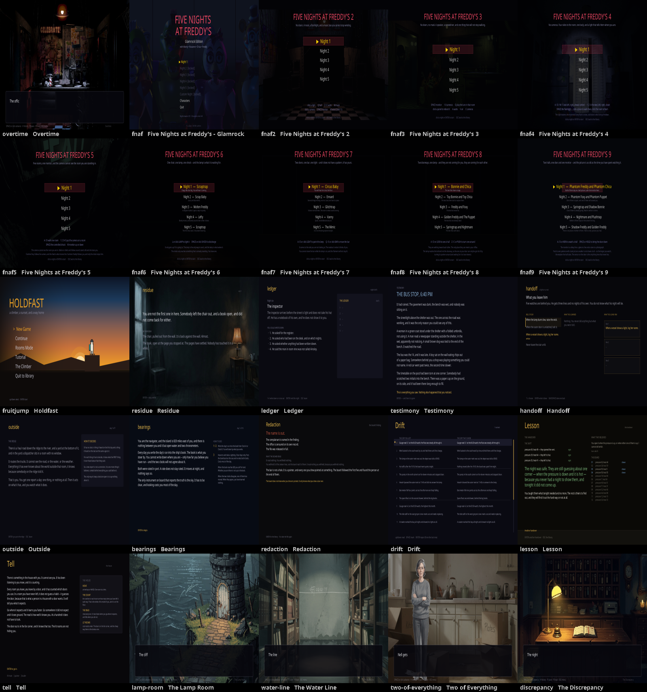

# Aside

A library of twenty games and the visual novel engine they are built on, in
Java, with a hand-writable script format, an **auditor** that reads a story the
way a player would before a player does, and a **phone shelf** that carries
every web build in one file.

Stories are plain text. The engine runs them, a blind-traversal bot can walk every path, and the auditor
reports what a reader will never see.

## Run

```bash
FX=/path/to/javafx/lib
MODS=javafx.controls,javafx.graphics,javafx.media,javafx.swing

javac --module-path $FX --add-modules $MODS -d out $(find src/main/java -name '*.java')

java --module-path $FX --add-modules $MODS -cp out aside.ui.Main
java --module-path $FX --add-modules $MODS -cp out aside.engine.Audit stories/overtime.aside
```

The auditor needs no display. The library does, and so does anything that
touches JavaFX at all — which is why the module path is on every line rather
than only on the compile. The commands above were run, not recalled.

(An earlier version of this file said `aside.vn.Presenter` — a class that has never existed. The audit commands
were all run before they were written down; that one line was written from memory, which is rule 17 in my own
notes: a claim traces to a run or a file, never to a recollection.)

## The script format

```
title: Overtime
start: wake

== wake ==
bg office_night
The building is awake. You are not sure you are.
~ checked_syslog true                    # an effect: sets a variable
* Read the log. -> log [if nights_survived >= 2]
* Say nothing. -> quiet
```

- `== name ==` starts a scene; `-> name` jumps to one, and plain text is narration.
- `bg`, `music`, `sfx` ask for art and sound by name — the auditor lists everything a script asks for, so
  missing assets are known before anyone plays.
- `* label -> target [if condition]` is a choice. Options are hidden unless their condition holds.
- `~ var value` sets a variable; conditions read them.

## The auditor

```bash
java -cp out aside.engine.Audit stories/<name>.aside
```

**What it reports, and which findings you can trust:**

| finding | meaning |
|---|---|
| `missing targets`, `dead ends` | a jump to a scene that does not exist, or a scene that goes nowhere. Always reliable — these need no search. |
| `vars read but never written`, `vars written but never read` | a typo'd variable name, or a flag set for no reason. Always reliable. |
| `choices that do not matter` | two options under the same condition going to the same place, or two options a reader cannot tell apart. Always reliable — **satisfiable is not the same as meaningful.** |
| `unreachable scenes`, `unreachable beats`, `never-offered picks` | **path** questions. Reliable only if the traversal finished. |

**The verdict tells you which.** If the walk did not complete, the report says `INCONCLUSIVE` and tells you
the command to raise the budget, because an unfinished search cannot prove a scene is unreachable:

```bash
java -Xmx2g -Daside.frontier.paths=true -Daside.budget=4000000 aside.engine.Audit <story>
```

`-Daside.frontier.paths=true` uses the path-replay frontier, which is how the large stories stay within
memory. It is the mode to use on anything long.

**A clean report is not always a finished one.** Distinguish `CLEAN` (nothing found, search complete) from
`INCONCLUSIVE` (nothing found so far). The report says which, on purpose.

## The games

The engine is half of this repository. The other half is a library of twenty
games in `src/main/java/aside/games/`, registered in `aside.game.Games.all()`
and kept by **one game per mechanic**: a game is in that list because it does
something no other game in it does, and when a new one is written that does
what an old one does, the old one is retired to `retired-games/` rather than
the library growing a second copy of an idea it already has. The FNAF
franchise is the one exception, because it was asked for by name.

There are three families:

- **Ten verb games** — residue, ledger, testimony, handoff, outside, bearings,
  redaction, drift, lesson, tell. One verb each.
- **Nine FNAF games** — FNAF 1 through 9, each taking away one thing the one
  before it assumed. FNAF 1 is Roxanne's; the rest are Loona's.
- **Fruit Jump** — the platformer, and the oldest thing here. It has water: pools
  form in the gaps in the walk, a body swims in them, holds its breath, and gets
  out by a breach hop at the surface. **UP or W** jumps on land and strokes
  upward in water; **DOWN or S** dives. `tools/ShotWater` is the only check that
  can see any of it — it drives the screen directly, counts water-coloured pixels
  and reads the climber back out by reflection, because a capture tool whose
  subject is off-screen still writes a png and still prints PASS.
  It also has **sound now**, which it never had: twelve cues generated from source by
  `tools/fruitjump-audio.py` and played by `Sound`. Until October 2026 every one of the twelve cue names had no
  file at all — the game had a way to ask for sound since it was written and nothing to play, and `AudioTest`
  never noticed because it only checks the visual novel's and FNAF's cue lists.
  And the climber has a face's worth of identity in its hair and pack: `CharacterConfig` is chosen in the
  customiser and read back by the gameplay screen.

### The phone shelf

```bash
java -cp out aside.game.PhoneShelf     # writes web/aside.html
```

`web/aside.html` is **every web build in one file** — the games are inlined as
gzipped base64 and played in an iframe, so there is one file to download and
nothing to install. It is derived rather than listed: it walks `Games.all()`,
puts on the shelf every game that has a web build, and lists underneath the
ones that do not. Add a game, give it a phone build, and it is on the shelf
with no change to the shelf.

Each game's phone build is generated by a `Web<Game>` class from a template in
`src/main/resources/<game>/web.html`, and **everything with a number in it
comes from the engine** rather than being copied into the page — the night
tables, the constants, the cast. The suite regenerates each build and compares
it to the checked-in copy, so a stale build fails rather than shipping.

The art is the one thing that is not single-sourced, because it cannot be:
`tools/fnaf*-phone-art.py` downscales the desktop's art to WebP once and the
output is committed, which is what keeps the Java generator reproducible from
Java alone.

### The FNAF games are measured, not asserted

Every FNAF game carries a headless bot and a ladder of policies — the obvious
play, the competent play, and the traps — and the suite prints the survival
rates over a few hundred seeds a night. The numbers are a *reading* of the
difficulty rather than a contract; what is asserted is the shape. Doing nothing
must be hopeless, the competent policy must beat the traps, and the week must
get harder. Several of the games' own comments record the design failures those
sweeps found, because a note that says why a rule exists is worth more than a
rule.

## What is in it



Every game in the library, one frame each, generated by `aside.tools.CheckGames` - which opens all of them,
ticks them, snapshots, and checks that what came out is a screen rather than a backdrop. **The image is
generated, not drawn**, and it is the only picture of this repository that shows the whole thing at once.

It is a **snapshot of one run**, and twenty-one of the twenty-three frames ARE reproducible - everything in them
advances on tick count. **Two are not, and the reasons are structural:**

- **`drift`** — `Drift.of()` is `new Drift(System.nanoTime())`. The frame is a function of *when* you ran it.
- **`ledger`** — it opens from a save (`Ledger.load(save)`), so the frame is a function of what a previous run
  left behind, and `CheckGames` runs the games in sequence.

That is worth knowing beyond this script: **a game whose opening frame depends on a clock or on a save cannot be
screenshot-compared by anything**, and the honest response is to say so rather than to add tolerance.

`docs/frames/` holds the twenty-one comparable frames and `tools/check-sheets.sh` compares them. It tried to
detect the non-comparable ones by running twice first, and that is a heuristic that lies: on the run that
prompted this, `drift` varied and `ledger` happened to match, so a coincidence was reported as a stale file. The
two are named now, with their reasons.

## Tests

```bash
tools/release-status.sh                                # does any repo need a new release?
tools/run-suites.sh                                    # every game suite, plus the web builds, one total
npm install && node tools/check-web.mjs                # just the phone builds, in a real browser
java --module-path $FX --add-modules $MODS -cp out aside.engine.SelfTest              # prints its own count
java --module-path $FX --add-modules $MODS -cp out aside.audio.AudioTest             # needs a display
java -cp out aside.games.fruitjump.engine.WaterProbe   # every pool is the shape it was built to be
```

`tools/run-suites.sh` runs **every game suite and prints one total** — nineteen of them, ~7,850 checks. It
discovers them by looking for `SelfTest.java` under `games/`, so a new game is covered the day it is added.

**It exists because until 2026-10-03 nothing ran them.** Every game had a suite, all nineteen were green, and no
script, doc or habit named more than one at a time — `grep -rl SelfTest tools/` found only `mutate.sh`, which
takes one suite as an argument. They also report in four different shapes (`791/791 checks passed`,
`=== 584 checks, 0 failed`, `=== 626 passed, 0 failed`, `all 112 checks passed`), so no two could be compared and
no total could be printed. The runner reads all four.

**`tools/release-status.sh` asks whether a player would notice.** Not "is main ahead" - that is a different
question with a different answer. Fruit-Jump and wake were each dozens of commits ahead of their releases on
2026-10-03 and needed nothing, because every one of those commits was documentation or tooling and the source a
player downloads had not moved. Each repository declares what a player actually gets (`web/aside.html`,
`src/main/java` and the jar, `index.html`) and this compares **that** range. `TAG=` overrides the release, which
is how the "something changed" path is tested without waiting for something to change.

`aside.engine.SelfTest` is the engine and story gate: it covers the engine, the auditor and the shelf.

**Every game is opened, drawn, and sent a key.** `aside.tools.CheckGames` walks `Games.all()`, opens each one,
ticks it, snapshots the frame and measures it, **then presses DOWN, DOWN, ENTER and SPACE** and checks nothing
throws and that the frame changed. Every game here has a suite and **none of them opens a screen** — the suites
test the games' *logic* — so a game can pass every check it has and still show a blank window on start. It writes
a png per game as well as a verdict, because when it does fail the next question is always "what did it look
like".

**The phone builds have their own sheet.** `docs/contact-sheet-phone.png` is the same idea for `web/`: every
phone build, rendered at phone size, one frame each - and reproducible for the same reason. `tools/check-web.mjs`
writes the frames and `tools/contact-sheet-web.mjs` puts them together. `tools/check-sheets.sh` checks both
sheets are current.

**The phone builds are checked by loading them.** `web/` holds 21 of them, and until 2026-10-03 the gate checked
only that each is *current* - regenerating it produces the same bytes - and **nothing ever opened one.** A file
can be perfectly up to date and still render nothing: that day a story title containing the literal text
`</script>` closed the export's script block early, and freshness would not have caught it. `tools/check-web.mjs`
loads each build in headless Chrome and fails on any page error. `run-suites.sh` calls it when its dependency is
installed and says so when it is not, rather than counting it as a pass. **It prints its own check
count, and the README deliberately does not repeat it** -- the number was
written down here and went stale three times in two days, which is what a
hand-maintained copy of a generated number does. `aside.audio.AudioTest`
exits non-zero if any cue is missing, so it works as a gate rather than a
report — but it opens a window, so it wants a display.
The FNAF self-tests print win rates *and* assert the shape that has to hold — a reasonable player wins,
the last night costs them something, a blackout at 5 AM is survivable. The FNAF 1 suite was a report with
no assertions at all until 2026-10-03, which this line claimed otherwise about; it is a gate now.

`WaterProbe` exits non-zero if any pool is the wrong shape: it asserts every water run is two rows with a
solid floor under it and no spike directly beneath, not just that the total cell count looks reasonable. The
count was 17 for a long time and the count was right — the map was wrong.

## What is in here

- **`stories/overtime.aside`** — the five-night FNAF Glamrock visual novel. **Six distinct endings**, and the
  spread is wide: `ending_remembered_close` is the rarest at 5,356 of the paths explored, `ending_overtime` the
  most common at 386,617. The auditor reports the distribution, so you can see which branches players actually
  reach — and a fuller audit of it is below.

A full-budget audit of Overtime, run rather than assumed:

```
scenes 131   beats 656   choice options 58      paths explored 1,546,467
distinct endings: 6
unreachable scenes: 0   (complete: 131/131 scenes reached, so nothing can be missing)
missing targets: 0      dead ends: 0      unreachable beats: 0
never-offered picks: 0  choices that do not matter: 0
vars read but never written: 0   vars written but never read: 0

CLEAN SO FAR (traversal partial: 131/131 scenes, budget hit)
```

The traversal was budget-limited, but the scene count is complete — which is why the unreachable list can still
be called complete while the picks line cannot. That distinction is the whole reason the verdict says which.
- **`stories/night-shift.aside`** — **a test fixture, not a story.** It contains deliberately planted
  problems (an unreachable scene, a variable typo, beats after a jump, and a fork whose choices do
  nothing) so the self-test can assert the auditor catches them. It is written to be read as well as
  parsed, but the bugs are the point.
- **`games/fnaf/`** — the FNAF Glamrock game as an engine module. A standalone copy lives in its own
  repository; the two are kept behaviourally identical, verified by their self-tests reporting the same
  numbers rather than by diffing text. `tools/check-fnaf-match.sh` does the cheap half of that as a first
  pass — the engine package, file by file, with the package line and this side's `aside.ui` imports
  normalised away — and says so rather than reporting a pass when the standalone is not there. Clone it
  beside this checkout (`git clone https://github.com/ChasePlank/fnaf ../fnaf`) and the gate runs it too.

  **The half neither of those covers is the screens**, which cannot be diffed because one runs on this engine's
  `UiManager` and the other on its own `Screen`/`ScreenManager`. So they are **looked at**: both copies were run
  side by side on 2026-10-03 and their menus render the same thing — same title, same cast line, same night list
  with the same locks, same progress line. That is a person looking rather than a check, and it is the only
  instrument for that half.
- **`audio/`** — the cues the scripts ask for: the visual novel's, FNAF's, and the platformer's twelve. Most are
  *generated* rather than committed by hand — see `tools/fnaf*-audio.py` and `tools/fruitjump-audio.py` — so the
  reasoning behind a sound is in the file that makes it.
